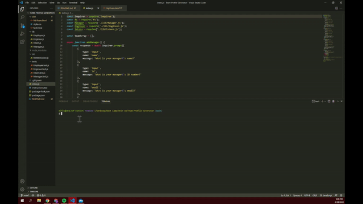
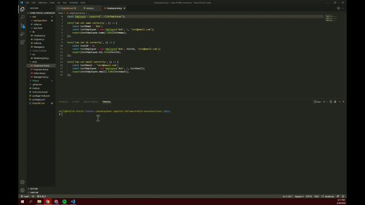

# Team-Profile-Generator

GitHub Repository: https://github.com/mlfitz2/Team-Profile-Generator

This program allows the user to enter the information of their hypothetical work team, and then creates a styled HTML file allowing them to view their team's information. All employees' information includes their name, title, id number and email. Additionally, the Manager's information includes their office number, the Engineers' information includes their GitHub username, and the Interns' information includes their school. 

The user follows prompts in the console to answer the questions in order to provde the necessary information. The application uses class constructors in Node.js to organize the information needed for all employees, and the additional info that's needed based on the employee's role in the company. 

Additionally, the "Tests" folder contains files that allow for the functionality of each role, and the Employee class in general, to be tested to ensure they will work properly. 

https://user-images.githubusercontent.com/95000888/156279626-1d20f64b-8824-43b6-9d9a-b2d4af324988.mp4

